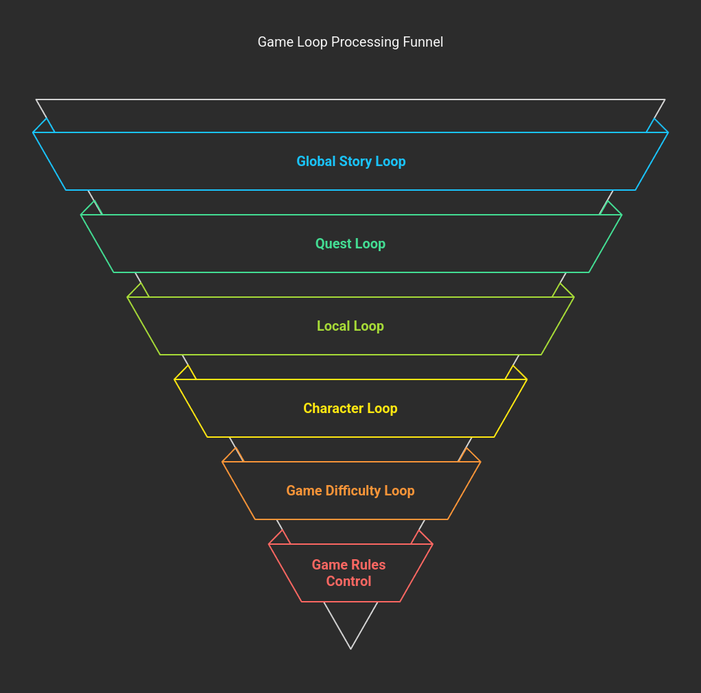
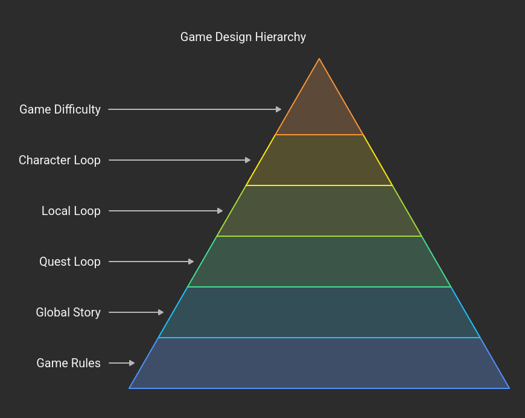
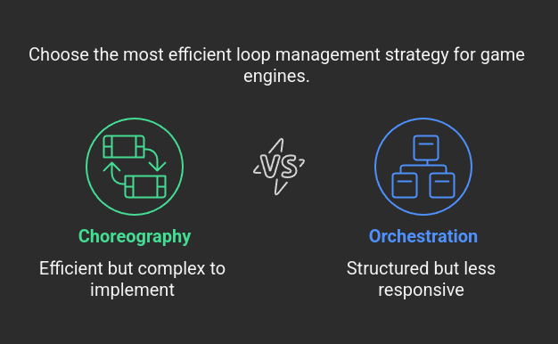

# Architecture

## Target

Agent should implement game engine loop for a text based RPG-like simulator game.

# Game Engine

## Feedback loop

### Positive Feedback Loop

A positive feedback loop in a game rewards the player with more of the desired outcome when they succeed, and penalizes them with less when they fail. This reinforcement system can have profound effects on the game's flow and players' experiences.‍

#### Snowballing Effect

One notable characteristic of a positive feedback loop is its tendency to create a snowball effect. Imagine a player who wins a match in a game. The system rewards their victory with a bonus, making them even more powerful or advantaged. This can lead to a significant gap between players and potentially shorten the duration of the game. As the winning player accumulates more rewards, they become increasingly dominant, discouraging those who are falling behind.

#### Discouragement for Losing Players

On the flip side, losing players face a double-edged sword. Not only do they experience the sting of defeat, but they also receive penalties, pushing them further down. This can quickly lead to player frustration and a sense of hopelessness. "I've already lost," they might say, resigning themselves to their fate, and this can significantly impact their enjoyment of the game.

#### Unbalancing Gameplay

In a game like chess, when a player captures an opponent's piece, it reduces the adversary's influence on the board, making it easier for the capturing player to win further. This positive feedback loop can make the game less challenging for the winning player, potentially detracting from the overall experience.

A similar scenario can be observed in games like League of Legends. When a player eliminates an opponent, they gain gold and experience, enabling them to level up and purchase items, making them even more superior in future battles. While this can be satisfying for the winning player, it can be frustrating for the losing side.

It's essential to note that a positive feedback loop doesn't necessarily reward the same player who triggered it. Instead, it can penalize other players, which still results in the same overall effect of unbalancing the game.

### Negative Feedback Loop

In contrast, a negative feedback loop in games offers penalties for success and rewards for failure. This mechanism can lead to comebacks and more balanced gameplay.

#### Potential for Comebacks

Negative feedback loops can create exciting comebacks in games. When a player is losing, the system provides them with bonuses, giving them a chance to catch up. Depending on the impact of the comeback mechanic, a game might remain undecided until the very end.

#### Prolonging the Game

If a game doesn't have a clear end condition (such as a time limit or a set number of rounds), negative feedback loops can potentially prolong the gameplay. This can result in thrilling matches that remain unpredictable until the last moment.

An example of a negative feedback loop can be found in Mario Kart. The player who is leading receives weaker items like a banana or a green shell, while those at the back of the race get powerful items like the Star or the Bullet Bill. This equalizer mechanic ensures that the race remains competitive and engaging for all players, regardless of their current positions.

Similar to the positive feedback loop, a negative feedback loop can also impact players who aren't directly responsible for triggering it.

### Levels of Feedback Loop

Game should have multiple levels of feedback loop:

#### Global Feedback Loop

World and global story progression. This is feedback loop that should move story forward and control when new events occur. Events that have effect on whole world and not limited by a player character, such alien invason or rouge AI breakthrough and simular. It should react to player actions, but mainly be controlled by global story. Player should be hard to affect this loop, but still possible. For example, starting rebelion or killing alien general would have long term effect on global story, but on other side more niche events like killing a regular alien would have minimal effect.

Also long lasting questlines that player chooses should have different consequences, reward and difficulty. For example, becoming a rebel leader or a scientist is harder than becoming a regular soldier. But it can provide more options and can affect global story in drastically different ways.

#### Quest Feedback Loop

Quests are feedback loop that should be affected or triggered by global story, but can be affected by player actions. They should be designed to be achievable and should provide enough reward to be worth completing. Multiple quests form a story. Game should have a side quests that can be related or not related to main story. Player should be able to choose whether he want to go through quest or ignore it, and he can choose different ways of completing a quest.
Whether player choose to go through it or not, quest story should progress on its own. It means if player choosed to not save a girl from a bandit, he eventually will hear in news that girl was killed by bandits.

Same way global story quests ignored eventually should have some effect on global story. And side quests should have effect on local story, or world, and in some cases can have effect on global story.

Player should be able to affect quests in various ways:

- By choosing different ways of completing a quest
- By making different story choices
- By saying different dialogs

After completion of a global story quest, it should directly affect global story and world, sometimes it can have long-lasting consiquences. For example, saving girl from bandits can lead to eventual war between two bandit factions.
After completion of a side quest, it should directly affect local story and local area and sometimes it can have long-lasting consiquences that also can affect global story.

##### Objectives

Each quest should have a main objective and multiple secondary objectives. Main objective should be the main goal of the quest, after completing which quest can be considered finished. Secondary objectives should be additional optional goals that can be achieved or ignored by player.

##### Rewards

Quest should have a different rewards, penalties and consequences based on completion status. Reward can depend on ways of completing a quest, achived objectives and it's difficuly. Penalties can be related to quest difficulty and player choices. Reward usally should be realted to the story, which this quest is part of. Reward and consiquences can be fully or partly known to user before quest start or can be revealed during or at the end of the quest.

#### Local Feedback Loop

Local feedback loop is a feedback loop that should be directly triggered by player actions. It should be related to quest, and can provide local rewards or penalities. For example, opening a door can lead to finding a new weapon, but also can trigger alarm and alert nearby enemies.
Local feedback loop directly affected by global and local story, world and quests that player have. Making actions and choices in this loop should have effect on quest loop that can affect story and world.

#### Character Feedback Loop

Character progression and development.
This is feedback loop that should control how player character develops. It should be affected by player actions, and local, quest and global loop. Player should be able to choose different ways of development through dialogs, choices and actions. For example, choosing to save a scientist that previusly created a rough AI, can lead to reward in which this scientist will create a new AI that will be more advanced and helpful, and will integrate with player character giving him new abilities.

#### Game Difficulty Loop

Game difficulty loop is a feedback loop that should control game difficulty. It should be affected by player actions, and affect local, quest and global loop.
Game diffucalty should be dynamicaly adjusted based on player actions and choices and play style and progress. For example, at the beginning of the game, enemies should be weaker and easier to defeat, but as the player progresses, enemies should become stronger and harder to defeat. But it should be justified by story and world. For example, bandits that were previously easy to defeat, cannot eventually become stronger and harder to defeat, but new army solders that player will encounter should be stronger and harder to defeat.

So game difficulty can effect on story or quest. For example, if player at the begining of the game will take quest to stole something in bandid base, he will face only low level bandits. But after he will become stronger at the middle of the game, he can encounter there bandit boss with bigger army and stronger weapons. If player will go to this quest even later, when he will be even stronger, he can encounter policy or army that will make a raid on this base and he will face even stronger enemies.

##### Dynamic Difficulty

If player is too easy to play game difficuly should be adjested to give player more challange. If player is too hard to play game difficuly should be adjested to make it easier to relax player. Also after each complex and hard game part, like complex battle or quest, game should provide some relaxed gameplay to player so he can feel difference and keep engaging. In reverse, after easy and relaxed gameplay, game should provide some complex and harder challenges so the player can feel progress and satisfaction.

Game difficulty should be controlled directly and inderectly by the system. For example:

Directly:

- Quests difficulty - Complexity to hack the system, find evidences to unrevel the murder or size of the reward that player will get.
- Enemy difficulty - Number of enemies, their strenght, armor, weapons and etc.
- World difficulty - Weather, time of day, etc.

Indirectly:

- Story affecting events - Events that occure in a game world. For example if player just goind through street he can encounter a bandit or find new friend depending whether is game becoming to booring or to hardcore. On other hand police or another band can make a raid during the mission so player can encounter even stronger enemies or other diffuculties.
- Affects of player actions on world and story. For example if player is hacking the system, but he is not careful enough, he can trigger alarm and alert nearby enemies. But if he is already going through complex and stressful quest for a long time, he can be lucky and hack the system without alerting anyone.

In general, main task of this loop is to keep player engaged and interested in a game. Creating a balance between easy and hard parts, and providing enough rewards for progress and achievements.

## Game Rules Control System

On top of supporting all game loops, it should also have a game rules control system. This system should validate all player and characters actions, and feedback loop systems.

It should control basic physics, for example not allowing player to move through walls or fly if not allowed by story or player abilities.

It should control story rules, for example not allowing player to say that he win the game if the story is not ended yet. Also it should not allow game to give player or other character impossible abilities that not justified by story or world.

It should control quest rules, for example not allowing player to say that he completed quest while he not yet acomplished main objective.

It should control character rules, for example not allowing player to use abilities that are not allowed by story or world.

# Implementation

Multiple ways to implement game loops are possible, but main part is the same.

## Game Turn (Tick)

After each player action game should process results of the actions, apply feedback loops, validate game rules and respond to player with feedback. All this processing and feedback is done as one turn (sometimes refered as tick) of the game.

Game turn have variable game time lenght, and can have different amount of events per turn. For example, if player is in a battle, he and enemies can make multiple hits and shots just in one second, which should be processed in one turn. On another hand if player is in a dialog, NPC can say long monologe while answering to player question, which can take few minutes, that also processed in one turn. On top of that if player goes to sleep, or were shoot and goes unconscious, or even goes in hypernation for a long trip - this is one turn with many different events that can take hours or days of the game time.

## Chained top-to-bottom loops

Game turn can be implemented as a chain of top-to-bottom loops. Each loop is a call of a model with dedicated prompt and set of parameters.

Set of loops called in order, where each loop result is added to history and user input and feed to the next loop:

- Global story loop
- Quest loop
- Local loop
- Character loop
- Game difficulty loop
- Game rules control system

Each loop can have different parameters, like temperature, top_p, max_tokens, etc.

## Chained bottom-to-top loops

This is the same as top-to-bottom loops, but in reverse order.

- Game difficulty loop
- Character loop
- Local loop
- Quest loop
- Global story loop
- Game rules control system

## Chained two-way loops

This is a combination of top-to-bottom and bottom-to-top loops.

- Global story loop
- Quest loop
- Local loop
- Character loop
- Game difficulty loop
- Character loop
- Local loop
- Quest loop
- Global story loop
- Game rules control system

## Conclusion

There no clear winner of the implementation. Using two-way loops probably will resul in more correct and linked story, but it will be much longer to compute. One way loops also not clear which should be applied, probably game engine manager agent should decide which loops to apply based on the game state.
Also Game Difficulty and Character loops are affect and affected by other loops on all stages, so it not clear whether they should be at the end of at the beginning of the chain. Probably they can be called at the end of the chain, but they can decide whether some changes should be applied and as result all previus loops should be evaluated again.

Game rules control system definetly should be at the end of the chain, because it should validate all player and characters actions, and feedback loop systems. But maybe it should be called at the begining also, to save on resources of calculating actions that break the rules. Also in case of breaking the rules, this system can trigger evaluation of all previus loops to find out what went wrong and ask loop to fix it.

## Choreography vs Orchestration

Loops managment can be implemented as a choreography or orchestration. In case of orchestration, game engine manager agent should decide which loops to call and in which order. It can not directly react ot loop results, and to optimize it, the result of each loop can be feed back to manager, so he will be able to decide whether need to call next loop or not.

In case of choreography, each loop after evaluating results should decide whether he is afecting the upper or bottom loop and as result whether it should be called next or not.

This way in case of simple actions like cleaning weapon will be called only one loop, but in case of more complex actions like hacking the system, it will be called multiple loops.

From first glance, it looks like choreography will be more efficient and will require less calls of LLM, but it will be more complex to implement.

## External Knowledge

Each loop should have access to external database about predefined game world, story, quests, characters, etc. For example, global story loop should know overral story ark, predefined global events and worlds and races that exist in the game.

Whether local loop not need so much knowledge, but he still need have deeper knowledge about the local area, quests, characters, weapons, and etc.

Simple RAG system should be enough, but need find a way to apply it efficiently to the game.

## User Interface

User interface should be implemented as a separate agent that will be responsible for displaying information to the player. It should present to player result of next turn of the game engine in this ways:

- Firstly describe scene in details, including all objects, characters, weapons, and results of the actions that happened in this scene.
- Then describe characters actions or dialogs that happened in this scene.
- Then in game AI character should suggest potential actions that player can do or dialogs that player can say.

After that player can choose next action or dialog and send it back to the game engine. Player not limited by suggested actions, he can say anything and do anything if it is in game rules.
